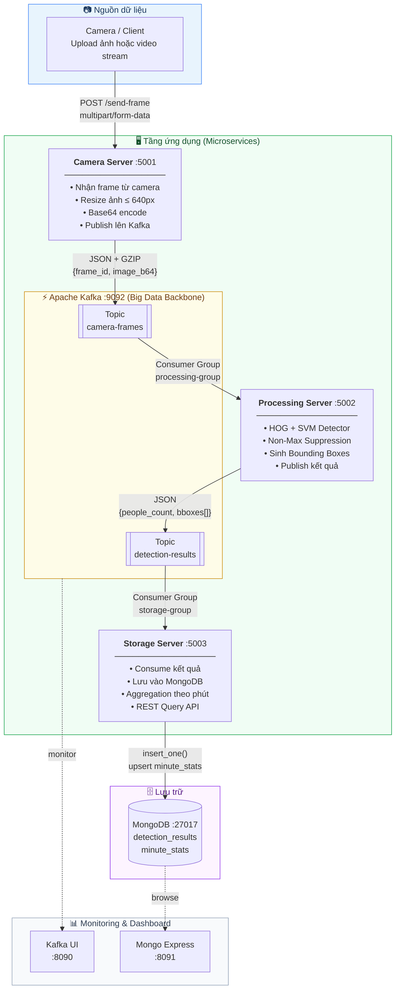

# People Counting System — Big Data Architecture

Hệ thống đếm số lượng người trong camera thời gian thực, xây dựng theo kiến trúc **Big Data** với Apache Kafka, MongoDB, và các microservices độc lập.

---

## Kiến trúc hệ thống


### Luồng dữ liệu chi tiết

| Bước | Từ | Đến | Dữ liệu |
|:---:|---|---|---|
| 1 | Camera / Client | Camera Server | File ảnh JPEG/PNG |
| 2 | Camera Server | Kafka `camera-frames` | `{frame_id, camera_id, image_b64, timestamp}` |
| 3 | Kafka `camera-frames` | Processing Server | Kafka message (GZIP) |
| 4 | Processing Server | Kafka `detection-results` | `{people_count, bounding_boxes[], processing_ms}` |
| 5 | Kafka `detection-results` | Storage Server | Kafka message |
| 6 | Storage Server | MongoDB | Document + per-minute aggregation |
---

## Công nghệ sử dụng

| Thành phần | Công nghệ | Mục đích |
|---|---|---|
| Message Broker | **Apache Kafka** | Truyền khung hình & kết quả giữa các server |
| Coordination | **Zookeeper** | Quản lý Kafka cluster |
| Object Detection | **HOG + SVM (OpenCV)** | Nhận diện người, sinh bounding boxes |
| Storage | **MongoDB** | Lưu trữ kết quả nhận diện |
| API Framework | **Flask** | REST API cho mỗi server |
| Container | **Docker / Docker Compose** | Triển khai toàn bộ hệ thống |
| Compression | **GZIP** | Nén dữ liệu trên Kafka |

---

## Cài đặt & Chạy

### Yêu cầu
- Docker ≥ 20.x
- Docker Compose ≥ 2.x
- Python 3.11+ để chạy test cục bộ

### Khởi động toàn bộ hệ thống

```bash
# Clone project
git clone https://github.com/<your-username>/people-counting-system.git
cd people-counting-system

# Khởi động tất cả services
docker compose up --build -d

# Xem logs
docker compose logs -f
```

### Kiểm tra trạng thái

```bash
curl http://localhost:5001/health   # Camera server
curl http://localhost:5002/health   # Processing server
curl http://localhost:5003/health   # Storage server
```

---

## API Reference

### 1. Camera Server (`http://localhost:5001`)

#### `POST /send-frame`
Upload một khung hình để xử lý.

```bash
curl -X POST http://localhost:5001/send-frame \
  -F "frame=@/path/to/image.jpg" \
  -F "camera_id=CAM-001"
```

**Response:**
```json
{
  "success": true,
  "camera_id": "CAM-001",
  "frame_id": "uuid-v4",
  "timestamp": "2024-01-15T10:30:00.000Z"
}
```

#### `POST /simulate-camera`
Tạo luồng khung hình giả lập (dùng cho demo/test).

```bash
curl -X POST http://localhost:5001/simulate-camera \
  -H "Content-Type: application/json" \
  -d '{"camera_id": "CAM-001", "num_frames": 10}'
```

---

### 2. Processing Server (`http://localhost:5002`)

#### `POST /detect`
Nhận diện người trực tiếp (không qua Kafka).

```bash
curl -X POST http://localhost:5002/detect \
  -F "image=@/path/to/image.jpg"
```

**Response:**
```json
{
  "people_count": 3,
  "bounding_boxes": [
    {"x": 120, "y": 80, "width": 60, "height": 120, "confidence": 0.89, "label": "person"},
    {"x": 300, "y": 100, "width": 65, "height": 130, "confidence": 0.92, "label": "person"},
    {"x": 450, "y": 90, "width": 58, "height": 115, "confidence": 0.85, "label": "person"}
  ],
  "processing_ms": 145.3,
  "detector": "HOG+SVM",
  "annotated_frame": "<base64-jpeg>"
}
```

---

### 3. Storage Server (`http://localhost:5003`)

#### `GET /results`
Lấy danh sách kết quả nhận diện gần nhất.

```bash
curl "http://localhost:5003/results?camera_id=CAM-001&limit=10"
```

#### `GET /results/{frame_id}`
Lấy kết quả của một khung hình cụ thể.

```bash
curl "http://localhost:5003/results/abc123"
```

#### `GET /summary`
Thống kê tổng hợp theo từng camera.

```bash
curl http://localhost:5003/summary
```

**Response:**
```json
{
  "cameras": [
    {
      "camera_id": "CAM-001",
      "total_frames": 150,
      "total_people": 420,
      "avg_people": 2.8,
      "max_people": 7,
      "last_seen": "2024-01-15T10:45:00Z"
    }
  ],
  "total_cameras": 1
}
```

#### `GET /timeline`
Biểu đồ xu hướng theo phút.

```bash
curl "http://localhost:5003/timeline?camera_id=CAM-001"
```

---

##  Chạy E2E Tests

```bash
# Cài thư viện test
pip install requests opencv-python-headless numpy

# Chạy toàn bộ test suite
python test-e2e.py
```

---

##  Dashboard UI

| Service | URL |
|---|---|
| Kafka UI | http://localhost:8090 |
| MongoDB Express | http://localhost:8091 |

---

## Cấu trúc MongoDB

```
database: people_counting
├── detection_results     — Kết quả nhận diện từng frame
│   ├── frame_id          (unique index)
│   ├── camera_id
│   ├── timestamp_done
│   ├── people_count
│   └── bounding_boxes[]
│
├── minute_stats          — Thống kê tổng hợp theo phút (per camera)
│   ├── camera_id
│   ├── minute            "YYYY-MM-DDTHH:MM"
│   ├── frame_count
│   └── total_people
│
└── camera_sessions       — Thông tin phiên camera (reserved)
```

---

## Cấu trúc dự án

```
people-counting-system/
├── docker-compose.yml          ← Orchestration toàn bộ hệ thống
├── test-e2e.py                 ← End-to-end test suite
│
├── camera-server/
│   ├── app.py                  ← Flask app nhận & publish frames
│   ├── requirements.txt
│   └── Dockerfile
│
├── processing-server/
│   ├── app.py                  ← HOG detection, publish results
│   ├── wsgi.py
│   ├── requirements.txt
│   └── Dockerfile
│
├── storage-server/
│   ├── app.py                  ← Consume results, save to MongoDB
│   ├── requirements.txt
│   └── Dockerfile
│
├── docker/
│   └── mongo-init.js           ← MongoDB init script
│
└── docs/
    └── architecture.md
```

---

## Big Data Context

| Tính chất Big Data | Cách xử lý trong hệ thống |
|---|---|
| **Volume** | Kafka tích lũy hàng triệu messages; MongoDB lưu trữ không giới hạn |
| **Velocity** | Stream processing thời gian thực qua Kafka topic |
| **Variety** | Xử lý nhiều camera, nhiều format ảnh khác nhau |
| **Scalability** | Mỗi service có thể scale ngang độc lập (consumer groups) |

---
